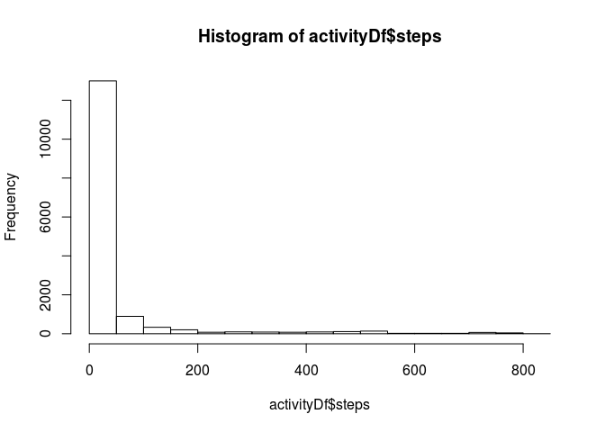

# Reproducible Research: Peer Assessment 1

## Loading and preprocessing the data


```r
library(lubridate)
library(dplyr)
```


```r
unzip ("activity.zip", exdir = "./")
activity <- read.csv("activity.csv", sep=",", stringsAsFactors = FALSE, quote="", dec=".", numerals = "no.loss", header=FALSE, col.names=c("steps","date", "interval"))
activityDf <- tbl_df(activity)
rm(activity)
activityDf$steps <- as.numeric(as.character(activityDf$steps))
```

```
## Warning: NAs introduced by coercion
```

```r
activityDf$interval <- as.numeric(as.character(activityDf$interval))
```

```
## Warning: NAs introduced by coercion
```

```r
summary (activityDf)
```

```
##      steps            date              interval     
##  Min.   :  0.00   Length:17569       Min.   :   0.0  
##  1st Qu.:  0.00   Class :character   1st Qu.: 588.8  
##  Median :  0.00   Mode  :character   Median :1177.5  
##  Mean   : 37.38                      Mean   :1177.5  
##  3rd Qu.: 12.00                      3rd Qu.:1766.2  
##  Max.   :806.00                      Max.   :2355.0  
##  NA's   :2305                        NA's   :1
```


## What is mean total number of steps taken per day?

```r
hist(activityDf$steps)
```

 

```r
mean(activityDf$steps, na.rm=TRUE)
```

```
## [1] 37.3826
```


## What is the average daily activity pattern?


## Imputing missing values


## Are there differences in activity patterns between weekdays and weekends?
