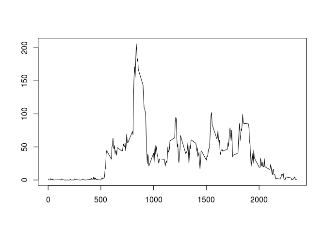
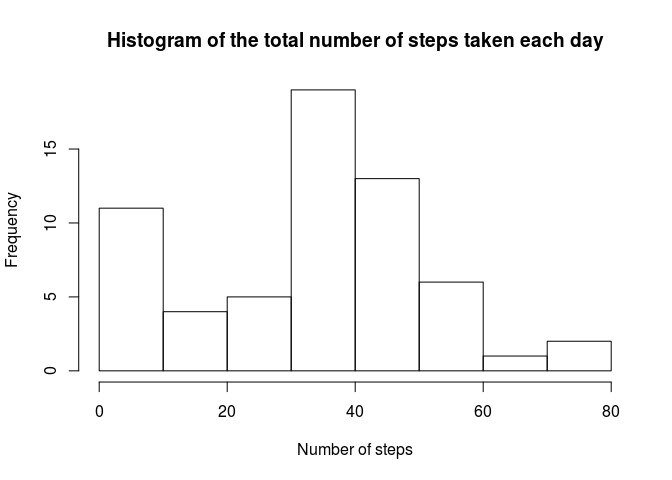

# Reproducible Research: Peer Assessment 1

## Loading and preprocessing the data


```r
library(plyr)
library(lubridate)
library(dplyr)
```


```r
unzip ("activity.zip", exdir = "./")
activity <- read.csv("activity.csv", sep=",", stringsAsFactors = FALSE, quote="", dec=".", numerals = "no.loss", header=FALSE, col.names=c("steps","date", "interval"),blank.lines.skip=TRUE,skip=1)
activityDf <- tbl_df(activity)
rm(activity)
activityDf$steps <- as.numeric(as.character(activityDf$steps))
activityDf$interval <- as.numeric(as.character(activityDf$interval))
```


## What is mean total number of steps taken per day?

```r
hist(activityDf$steps)
```

 

```r
mean(activityDf$steps, na.rm=TRUE)
```

```
## [1] 37.3826
```

```r
median(activityDf$steps, na.rm=TRUE)
```

```
## [1] 0
```


## What is the average daily activity pattern?

```r
dailyAct <- activityDf %>% group_by(interval) %>% summarise(mean(steps, na.rm=TRUE))
dailyAct <- plyr::rename(dailyAct, c("mean(steps, na.rm = TRUE)"= "meanSteps"))
plot(dailyAct$interval, dailyAct$meanSteps, ylab = "", xlab="",type="l")
```

 

```r
dailyActOrdered <- arrange(dailyAct,desc(meanSteps))
dailyActOrdered[1,1]
```

```
## Source: local data frame [1 x 1]
## 
##   interval
## 1      835
```


## Imputing missing values

```r
sum(is.na(activityDf$steps))
```

```
## [1] 2304
```

```r
#activityDf <-activityDf %>% group_by(date) %>% summarise(mean(steps, na.rm=TRUE))
medianDf <-activityDf %>% group_by(interval) %>% summarise(median(steps, na.rm=TRUE))
medianDf <- plyr::rename(medianDf, c("median(steps, na.rm = TRUE)"= "medianSteps"))

sum(is.na(medianDf$medianSteps))
```

```
## [1] 0
```

```r
filter(medianDf, is.na(medianSteps))
```

```
## Source: local data frame [0 x 2]
## 
## Variables not shown: interval (dbl), medianSteps (dbl)
```

```r
filter(dailyAct, is.na(meanSteps))
```

```
## Source: local data frame [0 x 2]
## 
## Variables not shown: interval (dbl), meanSteps (dbl)
```

```r
filter(activityDf, is.na(date))
```

```
## Source: local data frame [0 x 3]
## 
## Variables not shown: steps (dbl), date (chr), interval (dbl)
```

```r
filter(activityDf, is.na(interval))
```

```
## Source: local data frame [0 x 3]
## 
## Variables not shown: steps (dbl), date (chr), interval (dbl)
```

```r
medianDf <- inner_join(medianDf,activityDf, by='interval')
medianDf$steps[is.na(medianDf$steps)] <- medianDf$medianSteps[is.na(medianDf$steps)]
completeActivityDf <- select(medianDf, -medianSteps)
hist(completeActivityDf$steps)
```

 

```r
mean(completeActivityDf$steps, na.rm=TRUE)
```

```
## [1] 32.99954
```

```r
median(completeActivityDf$steps, na.rm=TRUE)
```

```
## [1] 0
```
## Are there differences in activity patterns between weekdays and weekends?
